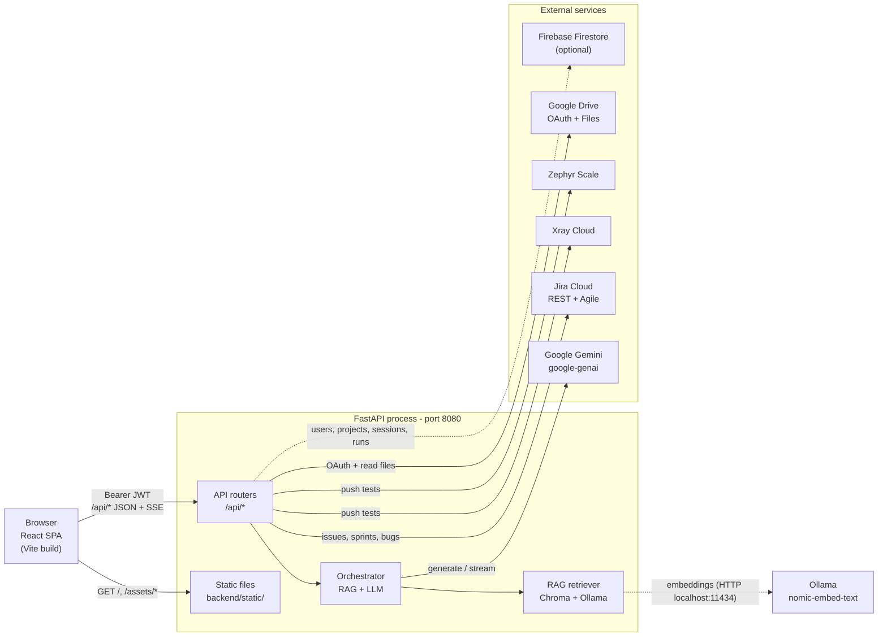
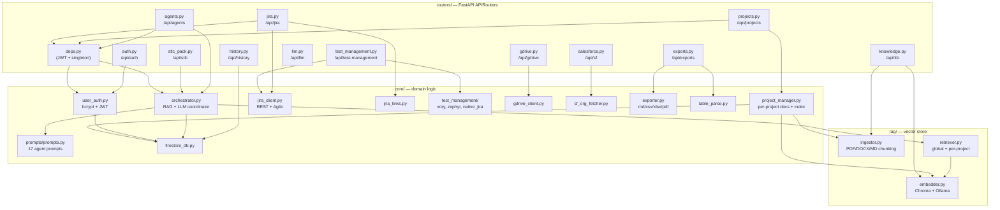
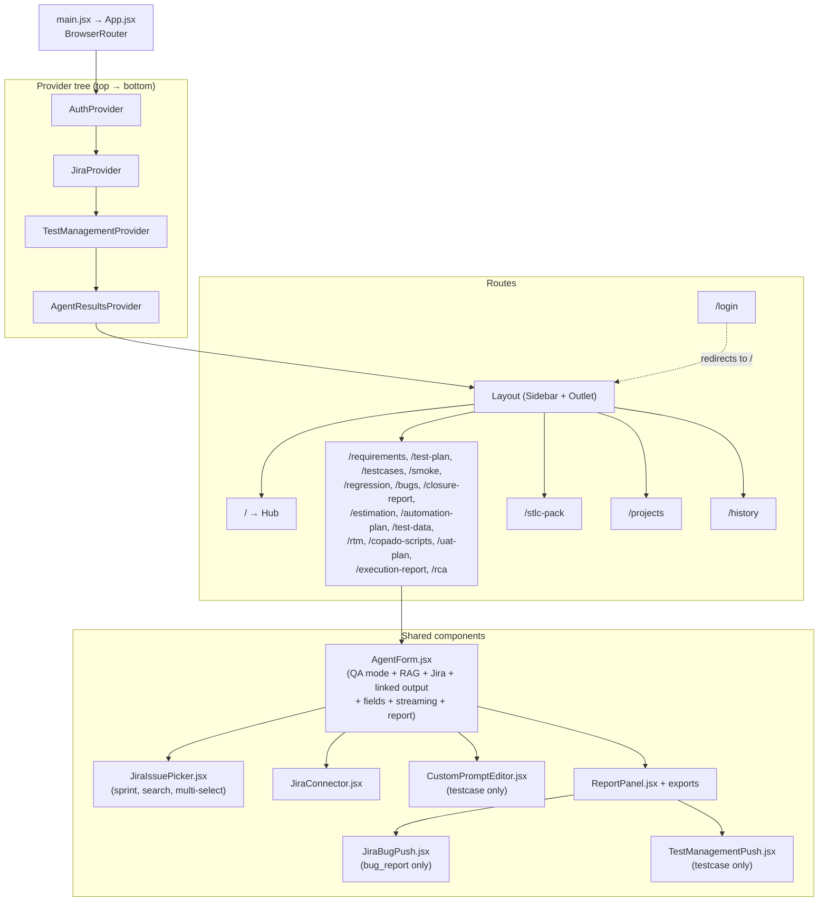
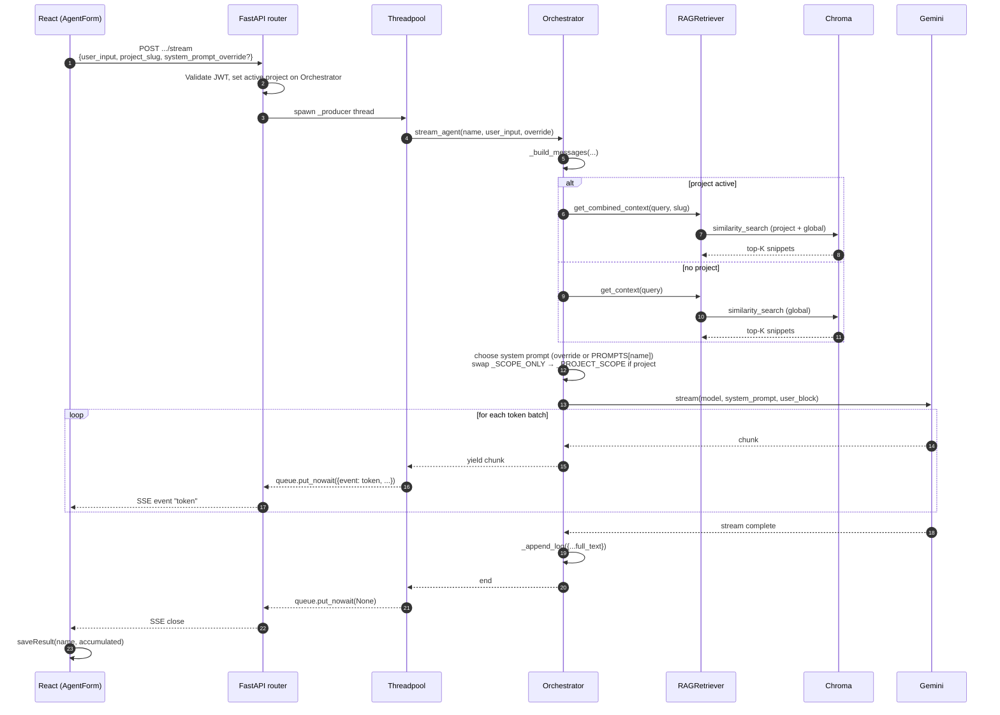
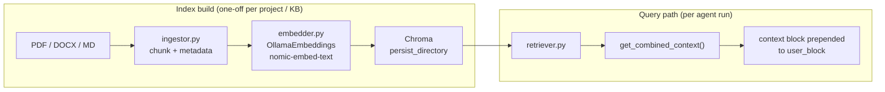
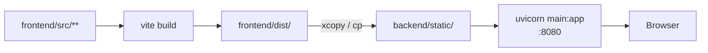

# Architecture

QA Studio is a **single-process** web app: FastAPI serves both the JSON API under `/api/*` and the pre-built React SPA from `backend/static/`. There is no separate web server in production — `start.bat` (or the Docker image) launches Uvicorn on port `8080`, and that's the whole deployment surface.

This document covers what's on `dev` (and merging into `master`) as of April 2026.

> Companion docs:
>
> - [`README.md`](./README.md) — how to install, run, and configure
> - [`FLOW_DIAGRAM.md`](./FLOW_DIAGRAM.md) — end-to-end user & agent flows

---

## 1. High-level system

Everything outside the `Server` box is optional except Gemini.

---

## 2. Backend layout

### Module responsibilities

| Module                                         | Responsibility |
|------------------------------------------------|----------------|
| `routers/agents.py`                            | `GET /{name}/prompt`, `POST /{name}/run`, `POST /{name}/stream`. Threadpools the sync orchestrator and bridges to SSE via `asyncio.Queue`. |
| `routers/jira.py`                              | Jira Cloud session management (memory + optional Firestore), JQL search, sprint listing via Agile API, bug creation with optional issue link. |
| `routers/test_management.py`                   | Pushes parsed test cases to Xray Cloud, Zephyr Scale, or native Jira `Test` issues. Optionally appends `Linked story: <KEY>` to every test case's preconditions. |
| `routers/gdrive.py`                            | Per-user OAuth flow + reads file content for Jira's full-issue view. |
| `routers/stlc_pack.py`                         | Runs five agents back-to-back over a single SSE stream, feeding each one the previous step's output as `linked_output`. |
| `core/orchestrator.py`                         | Builds `(system_prompt, user_block)` per request, retries through a fallback model chain, supports SSE streaming, persists run logs to Firestore or `logs/agent_log.jsonl`. |
| `core/prompts/prompts.py`                      | All 17 agent prompts. Two scope markers (`_SCOPE_ONLY`, `_PROJECT_SCOPE`) toggle automatically when a project is active. |
| `rag/embedder.py`                              | Wraps LangChain Chroma with Ollama `nomic-embed-text` embeddings, persisted under `backend/rag/vector_store/` (global) or `backend/projects/<slug>/vector_store/` (per project). |
| `rag/retriever.py`                             | Lazy-loads global + per-project Chroma stores and returns combined source-annotated context. |
| `core/firestore_db.py`                         | Optional Firestore client. When `STORAGE_BACKEND=firestore` it backs users, projects, Jira/Xray/Zephyr sessions, and agent run history. |

---

## 3. Frontend layout

### Provider responsibilities

| Provider                       | What it owns |
|--------------------------------|--------------|
| `AuthContext`                  | JWT, current user, login/logout, axios interceptor side-effects |
| `JiraContext`                  | Connection state, project list, `listIssues({ projectKey, sprintId, activeSprintsOnly, … })`, `listSprints`, `getIssue`, etc. |
| `TestManagementContext`        | Per-target connection + push helpers for Xray, Zephyr, native Jira |
| `AgentResultsContext`          | In-session map of `{agentName → {content, label, timestamp}}` so any agent can chain another agent's most-recent output |

### `AgentForm` rendering order (every agent)

1. **QA Mode card** — Salesforce / General toggle
2. **2-column grid** (`grid-cols-1 lg:grid-cols-2`):
   - Project Context (RAG) card
   - Link Previous Agent Output card *(hidden on `requirement`; that card spans full width)*
3. **Import from Jira** picker (when connected). On `test_plan` only it switches to multi-select + "Use entire sprint as scope".
4. **Customize System Prompt** card — `testcase` agent only.
5. Primary input fields (per-agent).
6. Generate button → SSE stream → `ReportPanel` with exports + (on `bug_report`) `JiraBugPush` + (on `testcase`) `TestManagementPush`.

---

## 4. Storage model

There are two interchangeable backends, selected by `STORAGE_BACKEND`:

| Concept           | `local` (default)                                         | `firestore`                                       |
|-------------------|-----------------------------------------------------------|---------------------------------------------------|
| Users             | `backend/data/users.json`                                 | `users` collection                                |
| Projects         | `backend/projects/<slug>/{meta.json,docs/,vector_store/}` | `projects` + on-disk vectors (always local)       |
| Agent run history | `backend/logs/agent_log.jsonl`                            | `agent_runs` collection                           |
| Jira session      | In-memory only                                            | `jira_sessions/<username>` (survives restarts)    |
| Xray session      | In-memory only                                            | `xray_sessions/<username>`                        |
| Zephyr session    | In-memory only                                            | `zephyr_sessions/<username>`                      |
| Global Salesforce KB | `backend/knowledge_base/` source + `backend/rag/vector_store/` | (always local)                            |

Vector indexes are always **on the local filesystem** because Chroma needs disk-backed collections.

---

## 5. Agent request lifecycle

The hot path on `POST /api/agents/{name}/stream`:

Key behaviours:

- **Threadpool bridge** — Uvicorn keeps its event loop free for other requests by running the sync orchestrator in a worker thread and pushing tokens through an `asyncio.Queue`.
- **Model fallback chain** — `_call_with_retry` / `_stream_with_fallback` walk `GEMINI_MODEL → GEMINI_FALLBACK_MODELS` with exponential backoff (max 30 s) on 429/503/`UNAVAILABLE`/`RESOURCE_EXHAUSTED`/`overloaded`.
- **System prompt override** — capped at 32 000 chars; `ValueError` is surfaced as HTTP 400 (run) or as an inline error chunk (stream).
- **Run log** — every successful run is appended to either Firestore (`agent_runs`) or `logs/agent_log.jsonl`.

See [`FLOW_DIAGRAM.md`](./FLOW_DIAGRAM.md) for the higher-level user-side flow and the STLC pack flow.

---

## 6. RAG architecture

Two separately persisted Chroma stores:

- **Global Salesforce KB** — `backend/rag/vector_store/`, populated from `backend/knowledge_base/` via `POST /api/kb/build`.
- **Per-project store** — `backend/projects/<slug>/vector_store/`, populated by `POST /api/projects/{slug}/build-index` after uploading docs.

When a project is active the orchestrator uses `get_combined_context` (project docs are authoritative scope, global Salesforce KB is background reference). When no project is active it uses `get_context` against the global store only.

---

## 7. External integrations

| Integration   | Auth model                        | Where credentials live                                |
|---------------|-----------------------------------|-------------------------------------------------------|
| **Jira Cloud**    | Email + API token, per user     | `JIRA_SESSIONS` (Firestore) **or** in-memory only     |
| **Xray Cloud**    | Client ID + secret, per user    | `XRAY_SESSIONS` (Firestore) **or** in-memory only     |
| **Zephyr Scale**  | API token, per user             | `ZEPHYR_SESSIONS` (Firestore) **or** in-memory only   |
| **Google Drive**  | OAuth 2.0 (3-legged), per user  | `gdrive_sessions` Firestore collection                |
| **Salesforce Org**| Username/password (sandbox/prod) | Per-request — never stored                           |
| **Gemini**        | API key (`GEMINI_API_KEY`)       | Server `.env`                                         |
| **Firebase Firestore** | Service-account JSON         | `FIREBASE_CREDENTIALS_JSON` env or `_PATH` file       |

All of these are optional except Gemini.

---

## 8. Build & deploy

- **Local development** — run `start.bat` (Windows) or `npm run dev` + `uvicorn main:app --reload --port 8080`.
- **Single-process production** — `start.bat` rebuilds the SPA on every launch and refreshes `backend/static/`. `Dockerfile` does the same in `multi-stage` form.
- **Render** — `render.yaml` defines a web service that runs the same Dockerfile.

The SPA fallback in `main.py` returns `index.html` for any non-`/api/*` path, so React Router handles deep-links cleanly even after a hard refresh.

---

## 9. What's intentionally out of scope

- **Multi-tenant isolation** beyond per-user JWT — every authenticated user shares the same backing store.
- **OpenAI / ChatGPT in the user-facing selector** — the adapter exists but the registration block in `orchestrator.py` is commented out so only Gemini shows up. Re-enable by un-commenting one block; no other code changes are needed.
- **Background task queue** — long-running agent runs use threadpool + SSE, not a Celery/RQ queue. This is fine because every run streams progress and the LLM is the bottleneck, not CPU.
