# Flow Diagrams

End-to-end user, agent, and integration flows for QA Studio (`dev` + `master` as of April 2026).

> Companion docs:
>
> - [`README.md`](./README.md) — install & configure
> - [`ARCHITECTURE.md`](./ARCHITECTURE.md) — module-level architecture

---

## 1. Top-level user journey

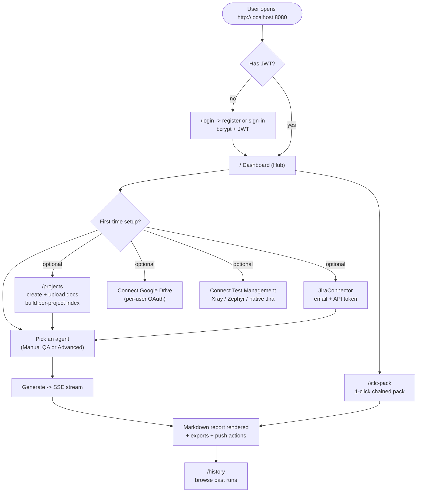

---

## 2. Standard agent run (the hot path)

This is what happens on every `Generate` click on any single-agent page (`/requirements`, `/test-plan`, `/testcases`, `/bugs`, …).

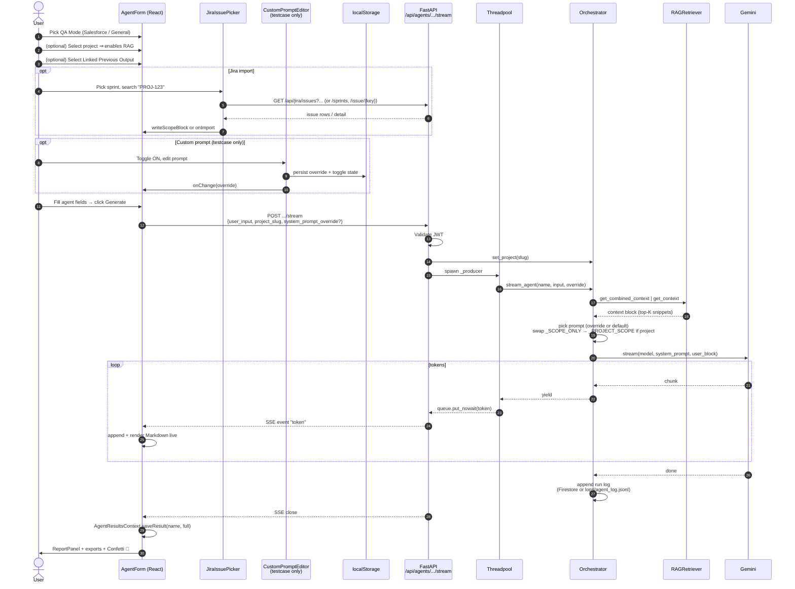

Notes:

- The override path catches `ValueError` (e.g. > 32 KB) and surfaces it as `**Error:** …` inside the stream rather than tearing the connection.
- On retryable Gemini errors (`429`, `503`, `UNAVAILABLE`, `RESOURCE_EXHAUSTED`, `overloaded`) the orchestrator walks the `GEMINI_FALLBACK_MODELS` chain with exponential backoff before raising.

---

## 3. AgentForm UI layout (every agent)

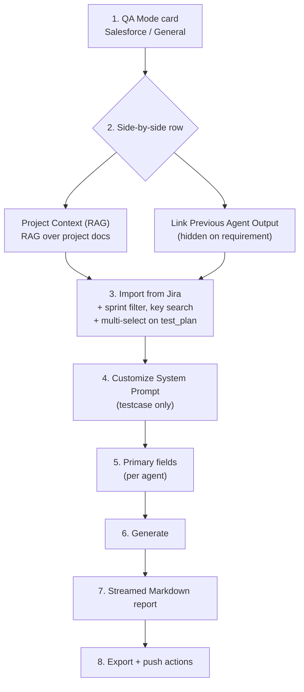

The grid degrades gracefully on the `requirement` agent (which has no upstream agent to chain from): the Project Context card spans the whole row.

---

## 4. Custom system prompt (Test Case Development)

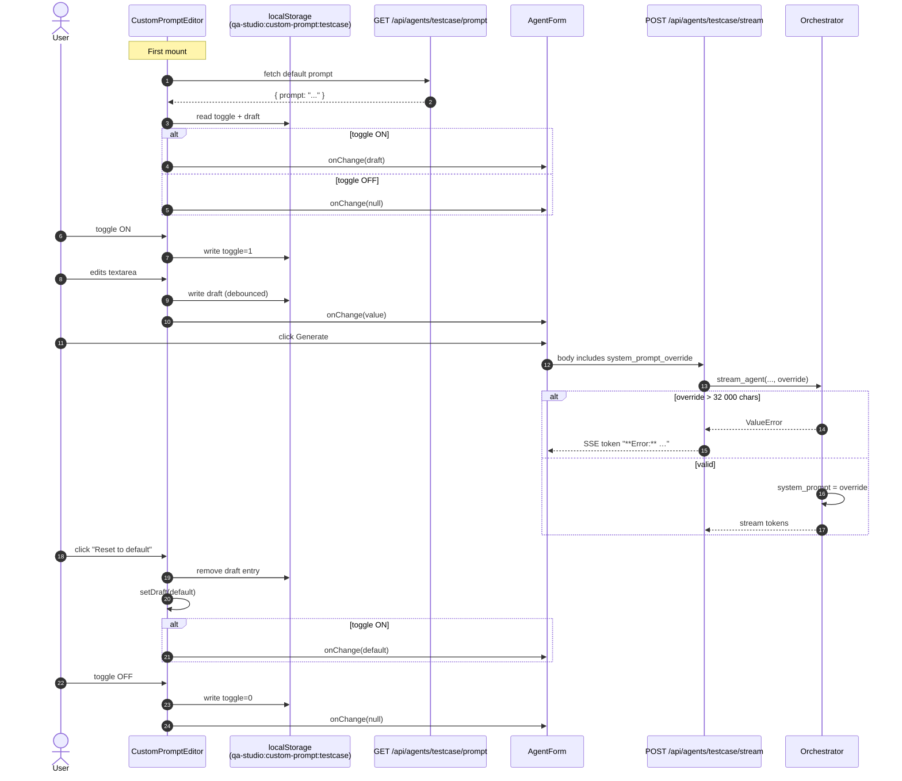

---

## 5. Jira import + sprint flow (every agent)

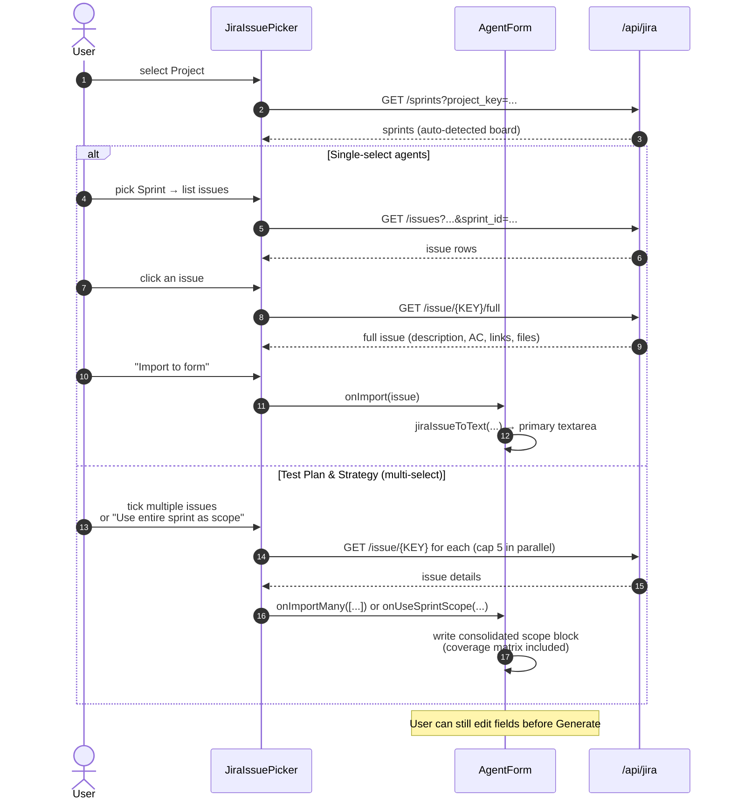

The picker also auto-detects when the user types a Jira key (e.g. `PROJ-123`) into any field and offers a one-click import via the same path.

---

## 6. Bug report → Jira (with optional link)

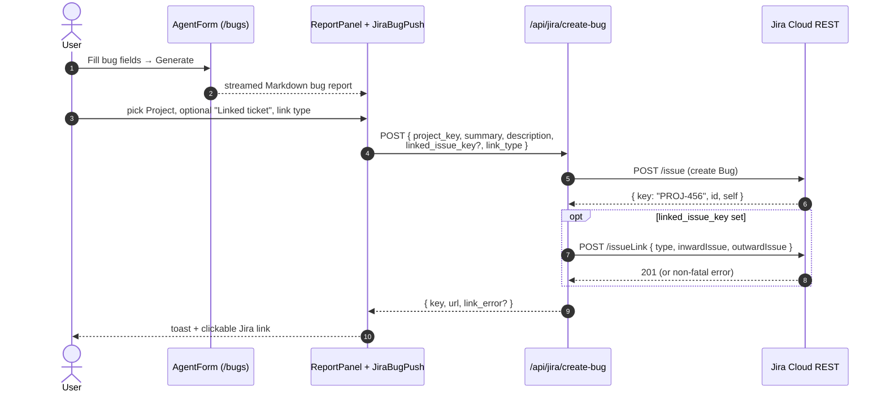

`link_error` is non-fatal: the bug is still created, the UI just shows a warning.

---

## 7. Test cases → Test Management push

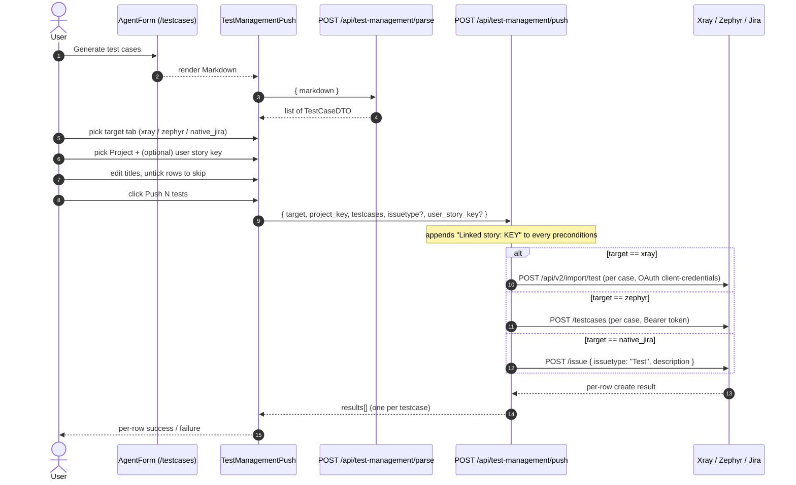

---

## 8. STLC pack (multi-agent chain over a single SSE stream)

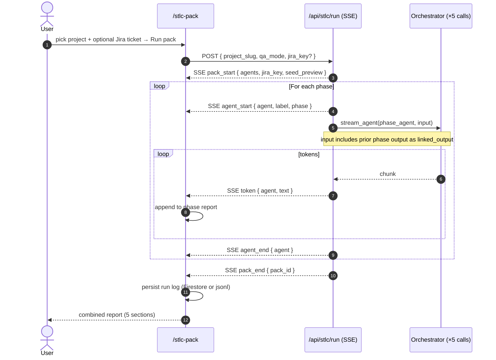

The five phases are fixed:

| Index | Phase                          | Agent key       |
|-------|--------------------------------|-----------------|
| 1     | Requirement Analysis           | `requirement`   |
| 2     | Test Planning                  | `test_plan`     |
| 3     | Test Case Development          | `testcase`      |
| 4     | Test Execution                 | `exec_report`   |
| 5     | Test Cycle Closure             | `closure_report`|

---

## 9. Project + RAG ingestion

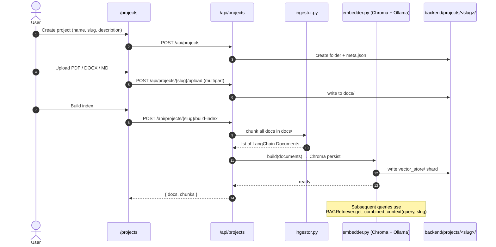

The same flow but for the **global Salesforce KB** runs through `POST /api/kb/build`, reading docs from `backend/knowledge_base/` into `backend/rag/vector_store/`.

---

## 10. Auth + session lifecycle

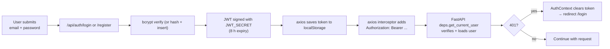

Per-integration sessions (Jira, Xray, Zephyr, Google Drive) are stored separately, keyed by `username`, and live either in process memory or Firestore depending on `STORAGE_BACKEND`.

---

## 11. Branch model

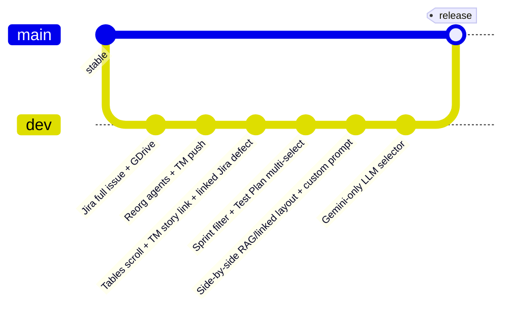

- `dev` carries every feature commit; PRs target `dev`.
- `master` is fast-forwarded from `dev` at release boundaries.
