# Flow Diagrams

End-to-end user, agent, and integration flows for QA Studio (`dev2` + `master` as of May 2026).

> Companion docs:
>
> - [`README.md`](./README.md) — install & configure
> - [`ARCHITECTURE.md`](./ARCHITECTURE.md) — module-level architecture
> - [`SKILLS.md`](./SKILLS.md) — caveman / cavecrew / graphify skill bundles (editor-side, not part of these flows)

---

## 1. Top-level user journey

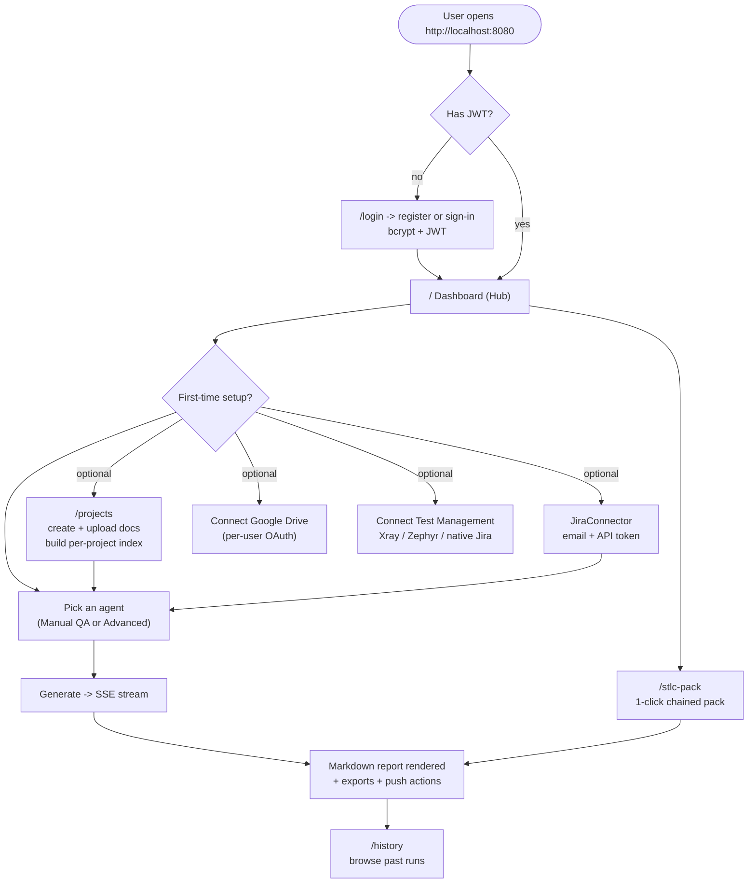
```mermaid
flowchart TD
  Start(["User opens http://localhost:8080"])
  Login{"Has JWT?"}
  Auth["/login -> register or sign-in<br/>bcrypt + JWT"]
  Hub["/ Dashboard (Hub)"]
  Setup{"First-time setup?"}
  Project["/projects<br/>create + upload docs<br/>build per-project index"]
  Jira["JiraConnector<br/>email + API token"]
  GD["Connect Google Drive<br/>(per-user OAuth)"]
  TM["Connect Test Management<br/>Xray / Zephyr / native Jira"]
  Agent["Pick an agent<br/>(Manual QA or Advanced)"]
  Run["Generate -> SSE stream"]
  Report["Markdown report rendered<br/>+ exports + push actions"]
  History["/history<br/>browse past runs"]
  StlcEntry["/stlc-pack<br/>1-click chained pack"]

  Start --> Login
  Login -- "no" --> Auth --> Hub
  Login -- "yes" --> Hub
  Hub --> Setup
  Setup -- "optional" --> Project
  Setup -- "optional" --> Jira
  Setup -- "optional" --> GD
  Setup -- "optional" --> TM
  Setup --> Agent
  Project --> Agent
  Jira --> Agent
  Agent --> Run --> Report
  Report --> History
  Hub --> StlcEntry
  StlcEntry --> Report
```

---

## 2. Standard agent run (the hot path)

This is what happens on every `Generate` click on any single-agent page (`/requirements`, `/test-plan`, `/testcases`, `/bugs`, …).

```mermaid
sequenceDiagram
    autonumber
    actor User
    participant UI as AgentForm (React)
    participant Picker as JiraIssuePicker
    participant CPE as CustomPromptEditor<br/>(every agent)
    participant LS as localStorage
    participant API as FastAPI<br/>/api/agents/.../stream
    participant TP as Threadpool
    participant Orch as Orchestrator
    participant RAG as RAGRetriever
    participant Gemini

    User->>UI: Pick QA Mode (Salesforce / General)
    User->>UI: (optional) Select project ⇒ enables RAG
    User->>UI: (optional) Select Linked Previous Output
    opt Jira import
      User->>Picker: Pick sprint, search "PROJ-123"
      Picker->>API: GET /api/jira/issues?... (or /sprints, /issue/{key})
      API-->>Picker: issue rows / detail
      Picker->>UI: writeScopeBlock or onImport
    end
    opt Custom prompt (every agent / sticky right rail)
      User->>CPE: Toggle ON, edit prompt
      CPE->>LS: persist override + toggle state<br/>(key qa-studio:custom-prompt:&lt;agent&gt;:&lt;qa_mode&gt;)
      CPE->>UI: onChange(override)
    end
    User->>UI: Fill agent fields → click Generate

    UI->>API: POST .../stream<br/>{user_input, project_slug, system_prompt_override?}
    API->>API: Validate JWT
    API->>Orch: set_project(slug)
    API->>TP: spawn _producer
    TP->>Orch: stream_agent(name, input, override)
    Orch->>RAG: get_combined_context | get_context
    RAG-->>Orch: context block (top-K snippets)
    Orch->>Orch: pick prompt (override or default)<br/>swap _SCOPE_ONLY → _PROJECT_SCOPE if project
    Orch->>Gemini: stream(model, system_prompt, user_block)
    loop tokens
      Gemini-->>Orch: chunk
      Orch-->>TP: yield
      TP-->>API: queue.put_nowait(token)
      API-->>UI: SSE event "token"
      UI->>UI: append + render Markdown live
    end
    Gemini-->>Orch: done
    Orch->>Orch: append run log<br/>(Firestore or logs/agent_log.jsonl)
    API-->>UI: SSE close
    UI->>UI: AgentResultsContext.saveResult(name, full)
    UI->>User: ReportPanel + exports + Confetti 🎉
```

Notes:

- The override path catches `ValueError` (e.g. > 32 KB) and surfaces it as `**Error:** …` inside the stream rather than tearing the connection.
- On retryable Gemini errors (`429`, `503`, `UNAVAILABLE`, `RESOURCE_EXHAUSTED`, `overloaded`) the orchestrator walks the `GEMINI_FALLBACK_MODELS` chain with exponential backoff before raising.

---

## 3. AgentForm UI layout (every agent)

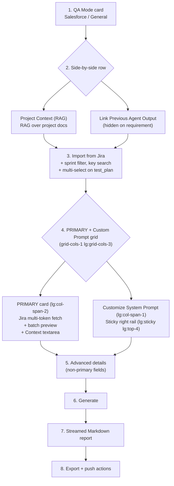
```mermaid
flowchart TD
  QA["1. QA Mode card<br/>Salesforce / General"]
  Row{"2. Side-by-side row"}
  RAG["Project Context (RAG)<br/>RAG over project docs"]
  Link["Link Previous Agent Output<br/>(hidden on requirement)"]
  Jira["3. Import from Jira<br/>+ sprint filter, key search<br/>+ multi-select on test_plan"]
  PrimaryGrid{"4. PRIMARY + Custom Prompt grid<br/>(grid-cols-1 lg:grid-cols-3)"}
  Primary["PRIMARY card (lg:col-span-2)<br/>Jira multi-token fetch<br/>+ batch preview<br/>+ Context textarea"]
  CPE["Customize System Prompt (lg:col-span-1)<br/>Sticky right rail (lg:sticky lg:top-4)"]
  Advanced["5. Advanced details<br/>(non-primary fields)"]
  Generate["6. Generate"]
  Stream["7. Streamed Markdown report"]
  Actions["8. Export + push actions"]

  QA --> Row
  Row --> RAG
  Row --> Link
  RAG --> Jira
  Link --> Jira
  Jira --> PrimaryGrid
  PrimaryGrid --> Primary
  PrimaryGrid --> CPE
  Primary --> Advanced
  CPE --> Advanced
  Advanced --> Generate --> Stream --> Actions
```

The 2-col row in step 2 degrades gracefully on the `requirement` agent (no upstream chain): the Project Context card spans the whole row. The 3-col grid in step 4 collapses to a single column below the `lg` breakpoint, with the editor stacking under the PRIMARY card.

### QA Test Artifacts per-tab layout

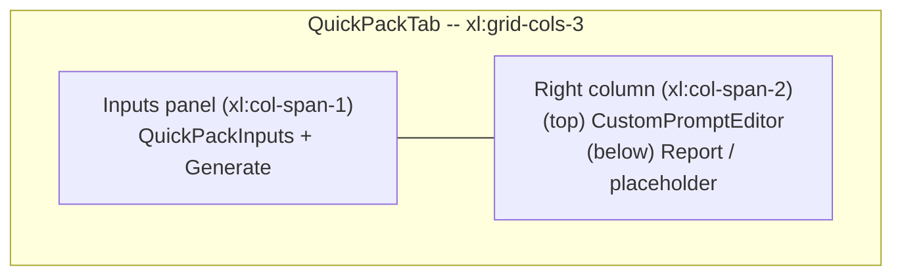
```mermaid
flowchart LR
  subgraph QATab [QuickPackTab -- xl:grid-cols-3]
    direction LR
    Inputs["Inputs panel (xl:col-span-1)<br/>QuickPackInputs + Generate"]
    RightCol["Right column (xl:col-span-2)<br/>(top) CustomPromptEditor<br/>(below) Report / placeholder"]
    Inputs --- RightCol
  end
```

The localStorage slot (`qa-studio:custom-prompt:<agent>:<qa_mode>`) is shared with the dedicated-page editor, so a draft saved on `/testcases` automatically appears on the QA Artifacts "Test Case Development" tab and vice versa. Per-tab Generate and bulk Generate both ship `system_prompt_override` while the toggle is ON.

---

## 4. Custom system prompt (every agent + QA Artifacts)

```mermaid
sequenceDiagram
    autonumber
    actor User
    participant CPE as CustomPromptEditor
    participant LS as localStorage<br/>(qa-studio:custom-prompt:&lt;agent&gt;:&lt;qa_mode&gt;)
    participant API as GET /api/agents/&lt;agent&gt;/prompt
    participant Form as AgentForm / QuickPackTab
    participant Stream as POST /api/agents/&lt;agent&gt;/stream
    participant Orch as Orchestrator

    Note over CPE: First mount or qa_mode flip
    CPE->>API: fetch default prompt for (agent, qa_mode)
    API-->>CPE: { prompt: "..." }
    CPE->>LS: read toggle + draft for (agent, qa_mode)
    alt toggle ON
      CPE->>Form: onChange(draft)
    else toggle OFF
      CPE->>Form: onChange(null)
    end

    User->>CPE: toggle ON
    CPE->>LS: write toggle=1
    User->>CPE: edits textarea
    CPE->>LS: write draft (debounced 300 ms)
    CPE->>Form: onChange(value)

    User->>Form: click Generate (per-agent page OR per-tab OR bulk)
    Form->>Stream: body includes system_prompt_override
    Stream->>Orch: stream_agent(..., override)
    alt override > 32 000 chars
      Orch-->>Stream: ValueError
      Stream-->>Form: SSE token "**Error:** …"
    else valid
      Orch->>Orch: system_prompt = override
      Orch-->>Stream: stream tokens
    end

    User->>CPE: click "Reset to default"
    CPE->>LS: remove draft entry
    CPE->>CPE: setDraft(default)
    alt toggle ON
      CPE->>Form: onChange(default)
    end

    User->>CPE: toggle OFF
    CPE->>LS: write toggle=0
    CPE->>Form: onChange(null)
```

The same component is mounted on every dedicated agent route AND inside every QA Test Artifacts tab. Because the localStorage slot is keyed by `(agent, qa_mode)`, a draft saved on `/testcases` (Salesforce mode) is automatically picked up on the QA Artifacts "Test Case Development" tab when it mounts, and vice versa. Flipping QA mode at the page level re-fetches the matching default and swaps the localStorage slot.

---

## 4a. History page lifecycle (Jira chip + per-project sections)

```mermaid
sequenceDiagram
    autonumber
    actor User
    participant Hist as /history (React)
    participant API as GET /api/history/
    participant Router as routers/history.py
    participant Helper as extract_jira_meta
    participant Store as Firestore agent_runs<br/>OR logs/agent_log.jsonl

    Hist->>API: GET /api/history/
    API->>Router: read top 200 records (newest first)
    Router->>Store: query agent_runs ORDER BY ts DESC LIMIT 200
    Store-->>Router: raw rows
    loop per row
      Router->>Router: decrypt input / output
      alt jira_key + jira_summary missing on disk
        Router->>Helper: extract_jira_meta(input)
        Note over Helper: accepts dict or str<br/>recurses into dict's string values<br/>matches "Jira &lt;Type&gt; KEY: Summary"<br/>falls back to bare-key search
        Helper-->>Router: (key | None, summary | None)
        Router->>Router: stamp jira_key / jira_summary on the row
      end
    end
    Router-->>API: list of decorated records
    API-->>Hist: { records }

    Hist->>Hist: group by project (synthetic "(no project)" bucket)
    Hist->>Hist: sort sections by most-recent ts
    Hist->>User: render collapsible per-project ToonCards
    Note over Hist,User: section header counts runs per agent;<br/>freshest section open by default

    User->>Hist: toggle agent chips inside a section
    Hist->>Hist: per-section sectionAgentFilters Set

    User->>Hist: type in global search
    Hist->>Hist: matches across<br/>jira_key | jira_summary | output_preview | agent | project

    User->>Hist: click a row
    Hist->>Hist: expand row → markdown + Excel/CSV/PDF/MD<br/>+ TestManagementPush (testcase, smoke, regression)<br/>+ JiraCommentPush (pre-fills issue key from rec.jira_key)
```

Row title resolution rules:

1. `rec.jira_key` AND `rec.jira_summary` -> render the `JiraTicketChip` with `KEY -- Summary` as the primary title (clickable to `{jiraUrl}/browse/{KEY}` when Jira is connected).
2. `rec.jira_key` only -> render the chip with just the key.
3. No Jira context -> render the first non-empty line of `rec.output_preview`, stripped of Markdown decoration and truncated to ~80 chars.

The agent label is always shown as a smaller violet badge next to the title so per-section "Filter by agent" chips remain visually anchored to row content.

---

## 5. Jira import + sprint flow (every agent)

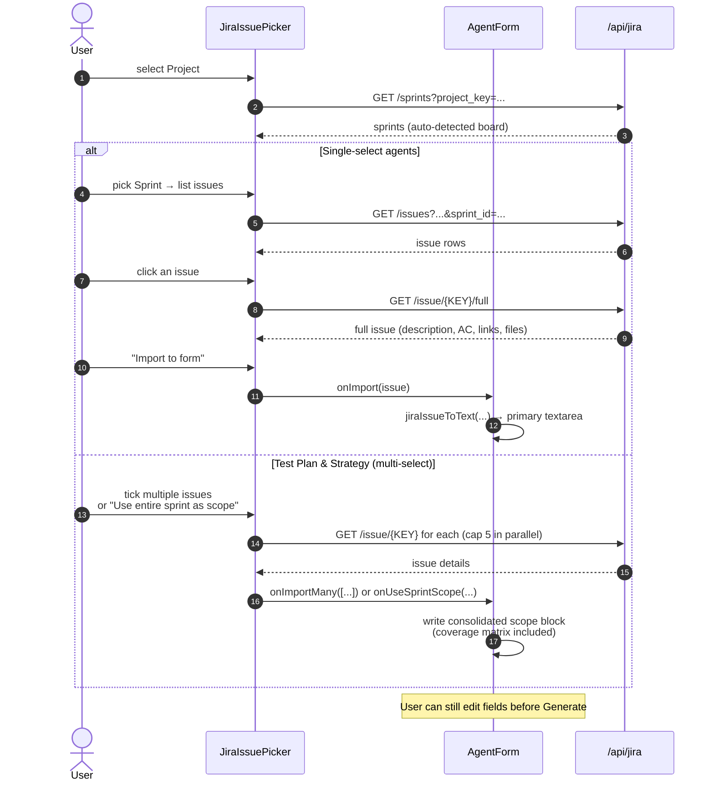
```mermaid
sequenceDiagram
    autonumber
    actor User
    participant Picker as JiraIssuePicker
    participant Form as AgentForm
    participant Jira as /api/jira

    User->>Picker: select Project
    Picker->>Jira: GET /sprints?project_key=...
    Jira-->>Picker: sprints (auto-detected board)

    alt Single-select agents
      User->>Picker: pick Sprint → list issues
      Picker->>Jira: GET /issues?...&sprint_id=...
      Jira-->>Picker: issue rows
      User->>Picker: click an issue
      Picker->>Jira: GET /issue/{KEY}/full
      Jira-->>Picker: full issue (description, AC, links, files)
      User->>Picker: "Import to form"
      Picker->>Form: onImport(issue)
      Form->>Form: jiraIssueToText(...) → primary textarea
    else Test Plan & Strategy (multi-select)
      User->>Picker: tick multiple issues<br/>or "Use entire sprint as scope"
      Picker->>Jira: GET /issue/{KEY} for each (cap 5 in parallel)
      Jira-->>Picker: issue details
      Picker->>Form: onImportMany([...]) or onUseSprintScope(...)
      Form->>Form: write consolidated scope block<br/>(coverage matrix included)
    end

    Note over Form: User can still edit fields before Generate
```

The picker also auto-detects when the user types a Jira key (e.g. `PROJ-123`) into any field and offers a one-click import via the same path.

---

## 5a. Jira 404 explanation (clean, actionable toast)

Atlassian returns the same opaque 404 body for "project doesn't exist on this tenant", "issue was deleted", and "your token can't see it". The backend disambiguates locally before the error reaches the toast, so the UI never leaks the REST URL.

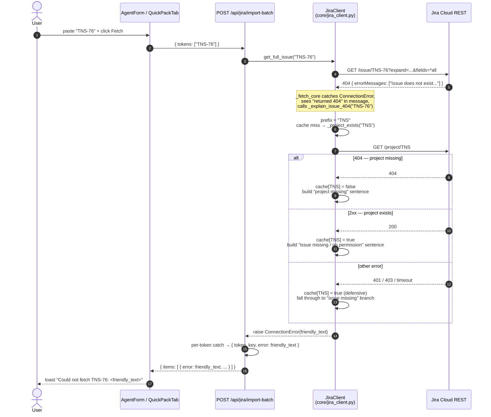
```mermaid
sequenceDiagram
    autonumber
    actor User
    participant Form as AgentForm / QuickPackTab
    participant Batch as POST /api/jira/import-batch
    participant Client as JiraClient<br/>(core/jira_client.py)
    participant Jira as Jira Cloud REST

    User->>Form: paste "TNS-76" + click Fetch
    Form->>Batch: { tokens: ["TNS-76"] }
    Batch->>Client: get_full_issue("TNS-76")
    Client->>Jira: GET /issue/TNS-76?expand=...&fields=*all
    Jira-->>Client: 404 { errorMessages: ["Issue does not exist..."] }
    Note over Client: _fetch_core catches ConnectionError,<br/>sees "returned 404" in message,<br/>calls _explain_issue_404("TNS-76")

    Client->>Client: prefix = "TNS"<br/>cache miss → _project_exists("TNS")
    Client->>Jira: GET /project/TNS
    alt 404 — project missing
      Jira-->>Client: 404
      Client->>Client: cache[TNS] = false<br/>build "project missing" sentence
    else 2xx — project exists
      Jira-->>Client: 200
      Client->>Client: cache[TNS] = true<br/>build "issue missing / no permission" sentence
    else other error
      Jira-->>Client: 401 / 403 / timeout
      Client->>Client: cache[TNS] = true (defensive)<br/>fall through to "issue missing" branch
    end

    Client-->>Batch: raise ConnectionError(friendly_text)
    Batch->>Batch: per-token catch → { token, key, error: friendly_text }
    Batch-->>Form: { items: [ { error: friendly_text, ... } ] }
    Form-->>User: toast "Could not fetch TNS-76: <friendly_text>"
```

The two human-readable sentences are:

- **Project missing / not visible on tenant** — `Project "TNS" doesn't exist (or isn't visible to your Jira user) on the connected tenant https://<tenant>.atlassian.net. Double-check the ticket key prefix, or reconnect Jira if you're pointed at the wrong Atlassian site.`
- **Project exists, issue doesn't** — `Issue TNS-76 wasn't found on the connected Jira tenant (...). It may have been deleted, moved to a different project, or your Jira user lacks permission to view it -- ask the ticket owner to grant Browse Projects on the TNS project.`

The `_project_exists` probe is cached per `JiraClient` instance so a batch of bad tokens against the same tenant doesn't re-hit Jira once per token. Non-404 failure modes (auth, SSL, timeout, malformed JSON) bypass the explainer and keep their original wording — they're already diagnosable. A diagnostic helper at `backend/scripts/probe_jira_404.py` reproduces the friendly message for any `(username, key)` pair using the encrypted Jira session in Firestore.

---

## 6. Bug report → Jira (with optional link)

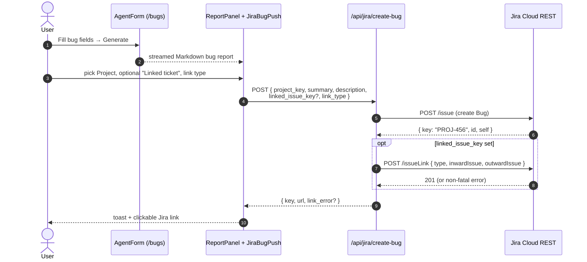
```mermaid
sequenceDiagram
    autonumber
    actor User
    participant Form as AgentForm (/bugs)
    participant Report as ReportPanel + JiraBugPush
    participant API as /api/jira/create-bug
    participant Jira as Jira Cloud REST

    User->>Form: Fill bug fields → Generate
    Form-->>Report: streamed Markdown bug report
    User->>Report: pick Project, optional "Linked ticket", link type
    Report->>API: POST { project_key, summary, description,<br/>linked_issue_key?, link_type }
    API->>Jira: POST /issue (create Bug)
    Jira-->>API: { key: "PROJ-456", id, self }
    opt linked_issue_key set
      API->>Jira: POST /issueLink { type, inwardIssue, outwardIssue }
      Jira-->>API: 201 (or non-fatal error)
    end
    API-->>Report: { key, url, link_error? }
    Report-->>User: toast + clickable Jira link
```

`link_error` is non-fatal: the bug is still created, the UI just shows a warning.

---

## 7. Test cases → Test Management push

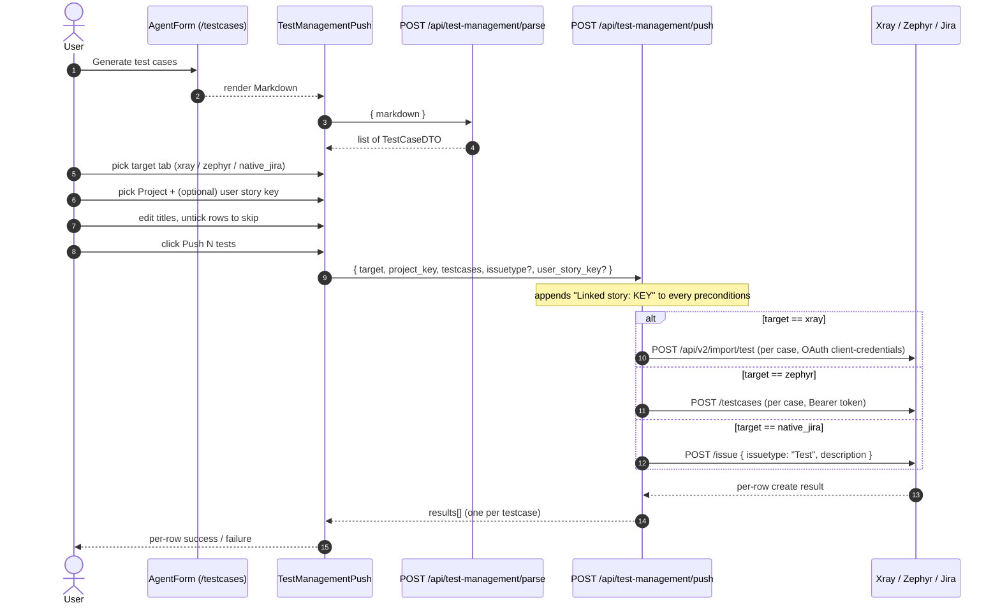
```mermaid
sequenceDiagram
    autonumber
    actor User
    participant Form as AgentForm (/testcases)
    participant TmPush as TestManagementPush
    participant Parse as POST /api/test-management/parse
    participant Push as POST /api/test-management/push
    participant Target as Xray / Zephyr / Jira

    User->>Form: Generate test cases
    Form-->>TmPush: render Markdown
    TmPush->>Parse: { markdown }
    Parse-->>TmPush: list of TestCaseDTO

    User->>TmPush: pick target tab (xray / zephyr / native_jira)
    User->>TmPush: pick Project + (optional) user story key
    User->>TmPush: edit titles, untick rows to skip
    User->>TmPush: click Push N tests

    TmPush->>Push: { target, project_key, testcases, issuetype?, user_story_key? }
    Note over Push: appends "Linked story: KEY" to every preconditions
    alt target == xray
      Push->>Target: POST /api/v2/import/test (per case, OAuth client-credentials)
    else target == zephyr
      Push->>Target: POST /testcases (per case, Bearer token)
    else target == native_jira
      Push->>Target: POST /issue { issuetype: "Test", description }
    end
    Target-->>Push: per-row create result
    Push-->>TmPush: results[] (one per testcase)
    TmPush-->>User: per-row success / failure
```

---

## 8. STLC pack (multi-agent chain over a single SSE stream)

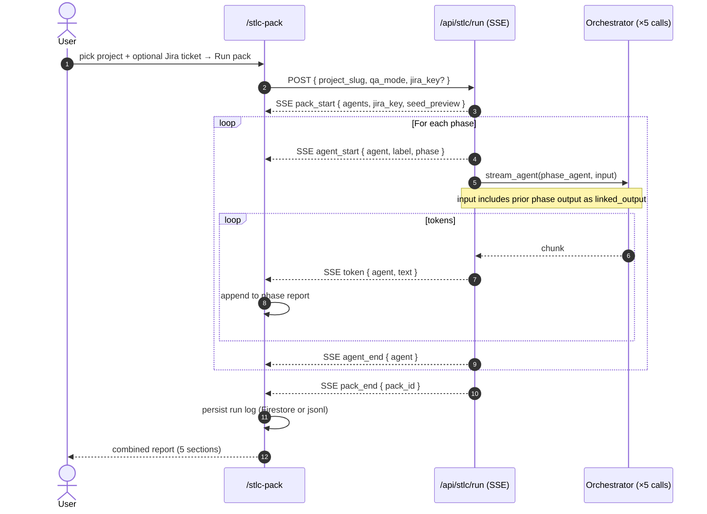
```mermaid
sequenceDiagram
    autonumber
    actor User
    participant Page as /stlc-pack
    participant API as /api/stlc/run (SSE)
    participant Orch as Orchestrator (×5 calls)

    User->>Page: pick project + optional Jira ticket → Run pack
    Page->>API: POST { project_slug, qa_mode, jira_key? }
    API-->>Page: SSE pack_start { agents, jira_key, seed_preview }

    loop For each phase
      API-->>Page: SSE agent_start { agent, label, phase }
      API->>Orch: stream_agent(phase_agent, input)
      Note over API,Orch: input includes prior phase output as linked_output
      loop tokens
        Orch-->>API: chunk
        API-->>Page: SSE token { agent, text }
        Page->>Page: append to phase report
      end
      API-->>Page: SSE agent_end { agent }
    end
    API-->>Page: SSE pack_end { pack_id }
    Page->>Page: persist run log (Firestore or jsonl)
    Page-->>User: combined report (5 sections)
```

The five phases are fixed:

| Index | Phase                          | Agent key       |
|-------|--------------------------------|-----------------|
| 1     | Requirement Analysis           | `requirement`   |
| 2     | Test Planning                  | `test_plan`     |
| 3     | Test Case Development          | `testcase`      |
| 4     | Test Execution                 | `exec_report`   |
| 5     | Test Cycle Closure             | `closure_report`|

---

## 9. Project + RAG ingestion

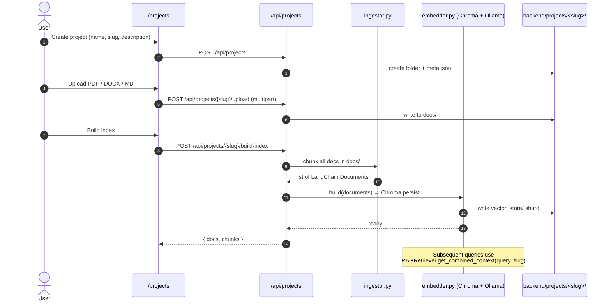
```mermaid
sequenceDiagram
    autonumber
    actor User
    participant UI as /projects
    participant Proj as /api/projects
    participant Ing as ingestor.py
    participant Vec as embedder.py (Chroma + Ollama)
    participant Disk as backend/projects/<slug>/

    User->>UI: Create project (name, slug, description)
    UI->>Proj: POST /api/projects
    Proj->>Disk: create folder + meta.json

    User->>UI: Upload PDF / DOCX / MD
    UI->>Proj: POST /api/projects/{slug}/upload (multipart)
    Proj->>Disk: write to docs/

    User->>UI: Build index
    UI->>Proj: POST /api/projects/{slug}/build-index
    Proj->>Ing: chunk all docs in docs/
    Ing-->>Proj: list of LangChain Documents
    Proj->>Vec: build(documents) → Chroma persist
    Vec->>Disk: write vector_store/ shard
    Vec-->>Proj: ready
    Proj-->>UI: { docs, chunks }

    Note over Vec: Subsequent queries use<br/>RAGRetriever.get_combined_context(query, slug)
```

The same flow but for the **global Salesforce KB** runs through `POST /api/kb/build`, reading docs from `backend/knowledge_base/` into `backend/rag/vector_store/`.

---

## 10. Auth + session lifecycle

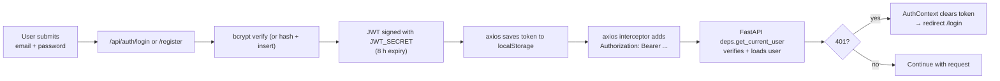
```mermaid
flowchart LR
  A["User submits<br/>email + password"]
  B["/api/auth/login or /register"]
  C["bcrypt verify (or hash + insert)"]
  D["JWT signed with JWT_SECRET<br/>(8 h expiry)"]
  E["axios saves token to localStorage"]
  F["axios interceptor adds<br/>Authorization: Bearer ..."]
  G["FastAPI deps.get_current_user<br/>verifies + loads user"]
  H{"401?"}
  I["AuthContext clears token<br/>→ redirect /login"]
  J["Continue with request"]

  A --> B --> C --> D --> E --> F --> G --> H
  H -- "yes" --> I
  H -- "no"  --> J
```

Per-integration sessions (Jira, Xray, Zephyr, Google Drive) are stored separately, keyed by `username`, and live either in process memory or Firestore depending on `STORAGE_BACKEND`.

---

## 11. Branch model

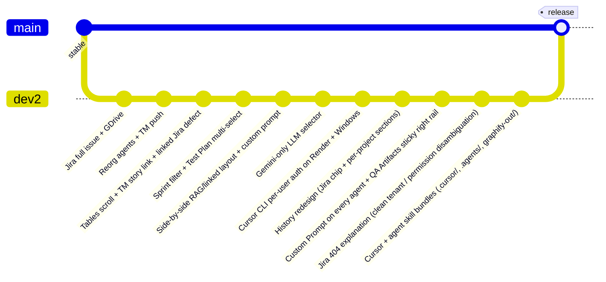
```mermaid
gitGraph
   commit id: "stable"
   branch dev2
   checkout dev2
   commit id: "Jira full issue + GDrive"
   commit id: "Reorg agents + TM push"
   commit id: "Tables scroll + TM story link + linked Jira defect"
   commit id: "Sprint filter + Test Plan multi-select"
   commit id: "Side-by-side RAG/linked layout + custom prompt"
   commit id: "Gemini-only LLM selector"
   commit id: "Cursor CLI per-user auth on Render + Windows"
   commit id: "History redesign (Jira chip + per-project sections)"
   commit id: "Custom Prompt on every agent + QA Artifacts sticky right rail"
   commit id: "Jira 404 explanation (clean tenant / permission disambiguation)"
   commit id: "Cursor + agent skill bundles (.cursor/, .agents/, graphify-out/)"
   checkout main
   merge dev2 tag: "release"
```

- `dev2` carries every feature commit; PRs target `dev2`.
- `master` is fast-forwarded from `dev2` at release boundaries.
